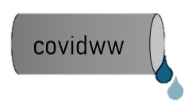
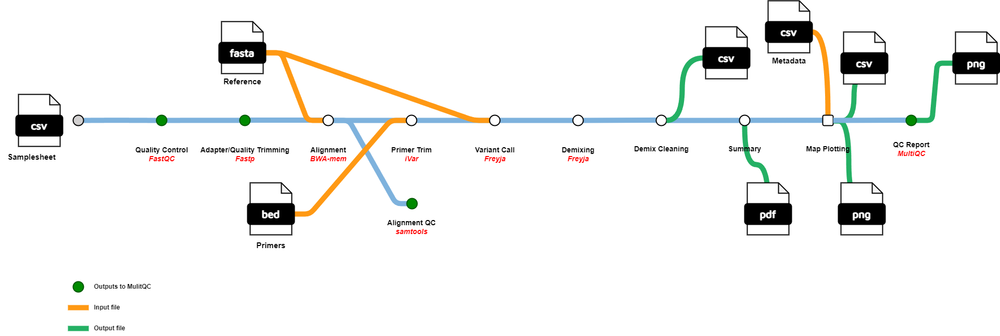

## Introduction

**covidww** is a bioinformatics pipeline built with nextflow following the nf-core template that is designed to analyze
sequencing of SARS-CoV-2 in wastewater samples and determine the relative abundance of the SARS-CoV-2 lineages within
the samples. It takes FASTQ files, primers in a BED file, a reference sequence (NC_045512.2 by default), and optional
metadata as input to perform quality control (QC), trimming, alignment, deconvolution, and produces demixing reports and 
visualizations as well as a detailed QC report.



1. Read QC ([`FastQC`](https://www.bioinformatics.babraham.ac.uk/projects/fastqc/))
2. SARS-CoV-2 Genome Indexing ([`BWA-mem2`](https://github.com/bwa-mem2/bwa-mem2))
3. Quality and adapter trimming ([`Fastp`](https://github.com/OpenGene/fastp))
4. Sequence alignment ([`BWA-mem2`](https://github.com/bwa-mem2/bwa-mem2))
5. Alignment indexing ([`SAMtools`](https://www.htslib.org/))
6. Alignment QC ([`SAMtools`](https://www.htslib.org/))
7. Primer trimming ([`iVar`](https://andersen-lab.github.io/ivar/html/index.html))
8. Sorting ([`SAMtools`](https://www.htslib.org/))
9. Variant Calling ([`Freyja`](https://github.com/andersen-lab/Freyja/tree/main/freyja))
10. Demixing ([`Freyja`](https://github.com/andersen-lab/Freyja/tree/main/freyja))
11. Demix cleaning
12. Summary plotting
13. Map plotting
14. Present QC for raw reads ([`MultiQC`](http://multiqc.info/))

## Usage

> [NOTE]
> Nextflow and Anaconda are required to be able to run this pipeline. Most processes can be run through containers and
> the software specified to do so must be installed before running.

> [NOTE]
> If you are new to Nextflow, please refer to [this page](https://nf-co.re/docs/usage/installation) on how to set-up
> Nextflow

First, prepare a samplesheet with your input data that looks as follows:

`samplesheet.csv`:

```csv
sample,fastq_1,fastq_2
Sample1,AEG588A1_S1_L002_R1_001.fastq.gz,AEG588A1_S1_L002_R2_001.fastq.gz
```

Where each row represents a pair of fastq files.

Optionally, you can prepare a metadata file that looks as follows:

`metadata.csv`:

```csv
Sample,City,State
Sample1,Indianapolis,Indiana
```

To be used to plot the data on a map.

After cloning this repository, you can run the pipeline using:

```bash
nextflow run covidww \
   -profile <docker/conda/singularity> \
   --input samplesheet.csv \
   --primers [primers.bed] \
   --outdir [OUTDIR]
```

And can optionally include the metadata by adding the metadata parameter:

```bash
nextflow run covidww \
   -profile <docker/conda/singularity> \
   --input samplesheet.csv \
   --primers [primers.bed] \
   --metadata metadata.csv \
   --outdir [OUTDIR]
```

## Additional covidww parameters
```--intermediate True``` will save all the intermediate files

```--adapter_fasta [fasta file]``` tells Fastp to look for these additional adapters to trim

```--save_trim_fail True``` tells Fastp to save the failed trim reads

```--save_merge True``` tells Fastp to save merged reads

```--radius [float]``` sets the radius of pie charts for map plotting

```--reference_genome [fasta file]``` changes the reference genome to the fasta file 


> [WARNING]
> Please provide pipeline parameters via the CLI or Nextflow `-params-file` option. Custom config files including those
> provided by the `-c` Nextflow option can be used to provide any configuration _**except for parameters**_;
> see [docs](https://nf-co.re/usage/configuration#custom-configuration-files).

## Pipeline output

Upon completion, the following output files will be saved in the ```OUTDIR```, and optionally the intermediate files
generated by the pipeline. When using ```intermediate True``` the ```OUTDIR``` will be populated in the structure 
outlined in [`output.md`](docs/output.md). Full descriptions of these files are also there.

- multiqc/multiqc_report.html
- wastewater_analysis_\<run date\>.csv
- demix_summary_\<run date\>.pdf
- abundance_map_\<run date\>.png (*only with metadata*)
- abundance_bar\<run date\>.png (*only with metadata*)
- metadata_merged_demix_result_\<run date\>.csv (*only with metadata*)

## Credits

covidww was originally written by David Schaeper.

## Citations

An extensive list of references for the tools used by the pipeline can be found in the [`CITATIONS.md`](CITATIONS.md)
file.

You can cite the `nf-core` publication as follows:

> **The nf-core framework for community-curated bioinformatics pipelines.**
>
> Philip Ewels, Alexander Peltzer, Sven Fillinger, Harshil Patel, Johannes Alneberg, Andreas Wilm, Maxime Ulysse Garcia,
> Paolo Di Tommaso & Sven Nahnsen.
>
> _Nat Biotechnol._ 2020 Feb 13. doi: [10.1038/s41587-020-0439-x](https://dx.doi.org/10.1038/s41587-020-0439-x).
